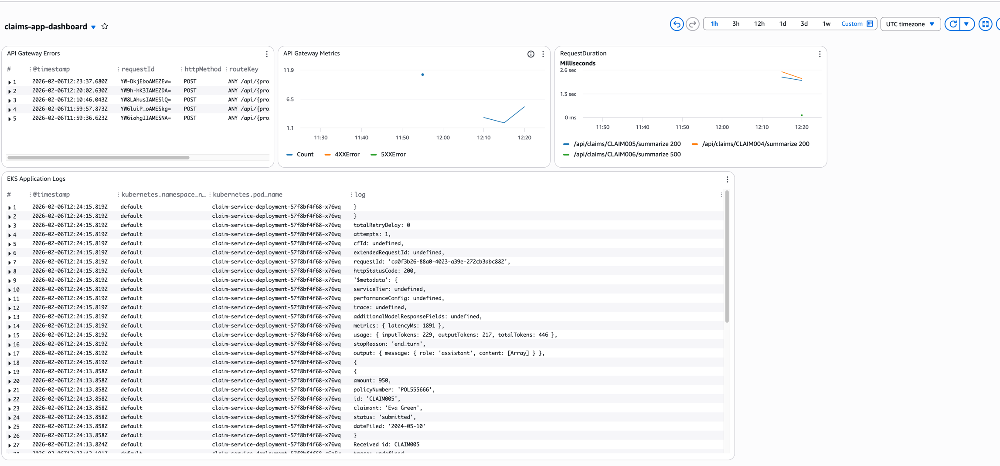
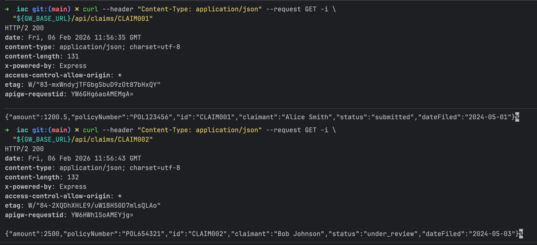
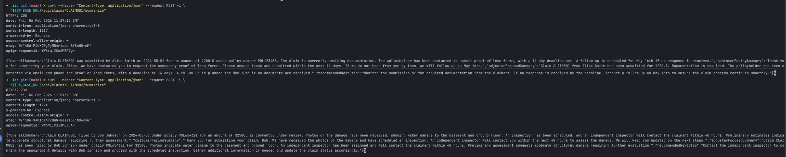
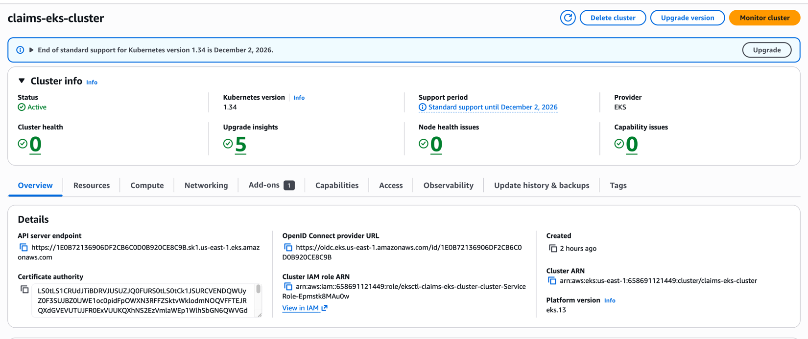
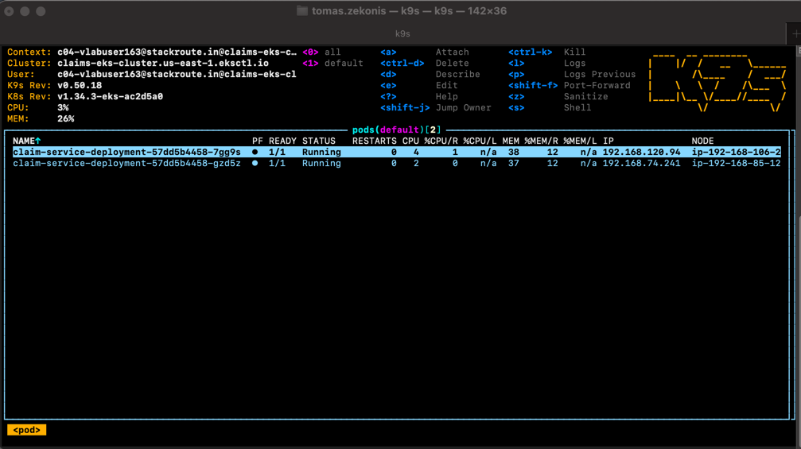
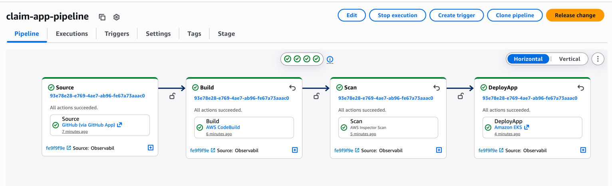
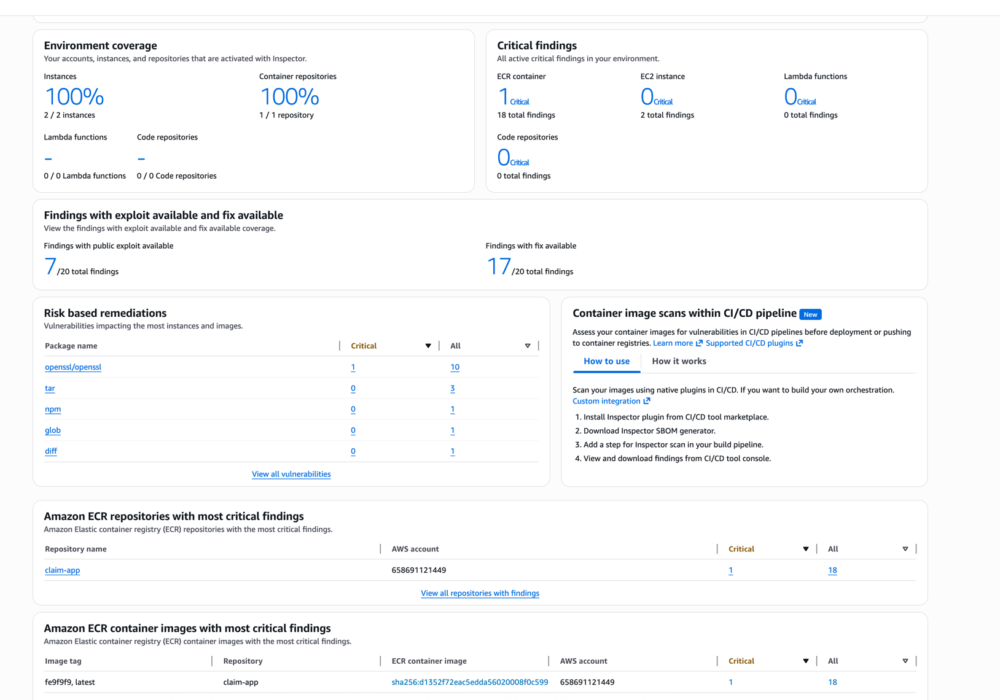
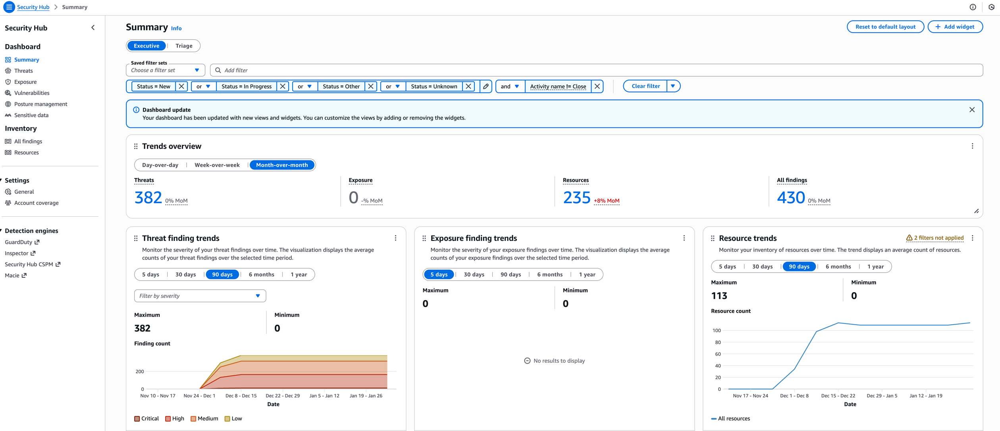

# Observability

This directory contains screenshots and documentation for the observability setup of the Claims Service.

---

## 📑 Table of Contents

- [CloudWatch Dashboard](#cloudwatch-dashboard)
- [API Traces](#api-traces)
- [EKS Cluster](#eks-cluster)
- [CI/CD Pipeline](#cicd-pipeline)
- [Security](#security)

---

## CloudWatch Dashboard

CloudWatch dashboard showing API metrics, response times, and error rates.

---

## API Traces

### Get Claims API

X-Ray trace for the `/api/claims/:id` endpoint showing DynamoDB calls.

### Summarize API

X-Ray trace for the `/api/claims/:id/summarize` endpoint showing DynamoDB, S3, and Bedrock calls.

---

## EKS Cluster

Amazon EKS cluster overview and container insights.

### Pods

Kubernetes pods running the Claims Service.

---

## CI/CD Pipeline

AWS CodePipeline execution showing Source, Build, Scan, and Deploy stages.

---

## Security

### Amazon Inspector

Container image vulnerability scanning results from Amazon Inspector.

### Security Hub

AWS Security Hub findings and security posture.

